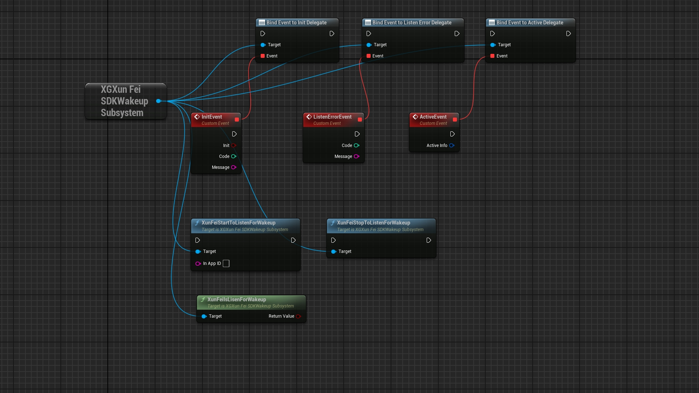

# XGXunFeiSDK
# 简介
&emsp;&emsp;虚幻引擎5用来接入科大讯飞SDK的工程,目前主要提供了离线唤醒(Windows)功能
# 流程
&emsp;&emsp;a.设置提示词; 
&emsp;&emsp;b.下载科大讯飞SDK; 
&emsp;&emsp;c.拷贝资源到插件中 
&emsp;&emsp;d.蓝图调用接口 
# 详解
## 设置提示词
略. 
自行到科大讯飞官网注册,并在控制台中进行设置即可 
注:该功能名为离线唤醒,并非离线唤醒(新版) 
## 下载科大讯飞SDK
下载后的文件结构如下: 

Windows平台SDK 
 离线语音唤醒功能。 
-------------------------------------------------------------------------------- 
《目录结构一览》 
Windows_awaken_exp1227_06*****.zip:
 
bin： 
|-- msc  
&nbsp;&nbsp;&nbsp;&nbsp;|-- msc.cfg（作用：msc调试、生成msc日志） 
&nbsp;&nbsp;&nbsp;&nbsp;|-- res（资源文件） 
&nbsp;&nbsp;&nbsp;&nbsp;|-- del.bat  
|-- 示例程序exe（samples目录下对应示例生成的exe） 
|-- audio  
|-- msc.dll（32位动态链接库） 
|-- msc_x64.dll（64位动态链接库） 
 
doc： 
|-- readme.txt  
 
include：调用SDK所需头文件 
 
libs： 
|-- msc.lib（32位静态链接库） 
|-- msc_x64.lib（64位静态链接库） 
 
samples： 
|-- samples.sln（VS工程文件，适用于vs2010、vs2012及以上Visual Studio版本） 
|-- awaken_sample（离线语音唤醒示例） 
&nbsp;&nbsp;&nbsp;&nbsp;|-- awaken_sample.c 

核心资源路径如下: 
Windows_awaken_exp1227_06*****/bin/msc/res/ivw/wakeupresource.jet 
头文件路径如下: 
Windows_awaken_exp1227_06*****/include/msp_cmn.h 
Windows_awaken_exp1227_06*****/include/msp_errors.h 
Windows_awaken_exp1227_06*****/include/msp_types.h 
Windows_awaken_exp1227_06*****/include/qivw.h 
第三方库路径如下: 
Windows_awaken_exp1227_06*****/bin/msc_x64.dll 
Windows_awaken_exp1227_06*****/libs/msc_x64.lib 
## 拷贝资源到插件中
拷贝核心资源到以下路径即可: 
****Project/Plugins/XGXunFeiSDK/Source/ThirdParty/XGXunFeiSDKLibrary/x64/Release/wakeupresource.jet 
拷贝头文件到以下路径即可: 
****Project/Plugins/XGXunFeiSDK/Source/ThirdParty/XGXunFeiSDKLibrary/Public/msp_cmn.h 
****Project/Plugins/XGXunFeiSDK/Source/ThirdParty/XGXunFeiSDKLibrary/Public/msp_errors.h 
****Project/Plugins/XGXunFeiSDK/Source/ThirdParty/XGXunFeiSDKLibrary/Public/msp_types.h 
****Project/Plugins/XGXunFeiSDK/Source/ThirdParty/XGXunFeiSDKLibrary/Public/qivw.h 
拷贝第三方库到以下路径即可: 
****Project/Plugins/XGXunFeiSDK/Source/ThirdParty/XGXunFeiSDKLibrary/x64/Release/msc_x64.dll 
****Project/Plugins/XGXunFeiSDK/Source/ThirdParty/XGXunFeiSDKLibrary/x64/Release/msc_x64.lib 
## 蓝图调用接口
绑定代理,调用接口,等待回调
  
